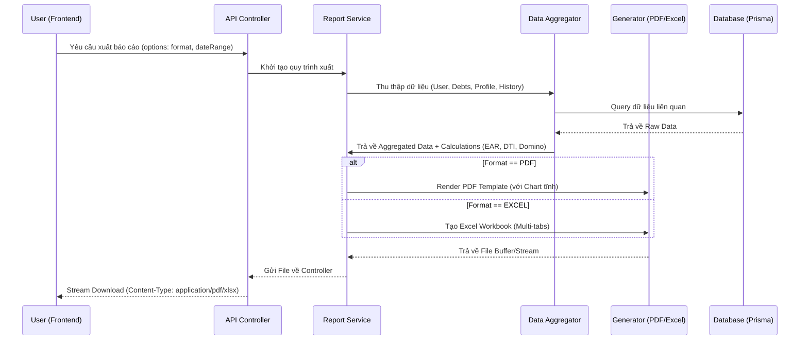
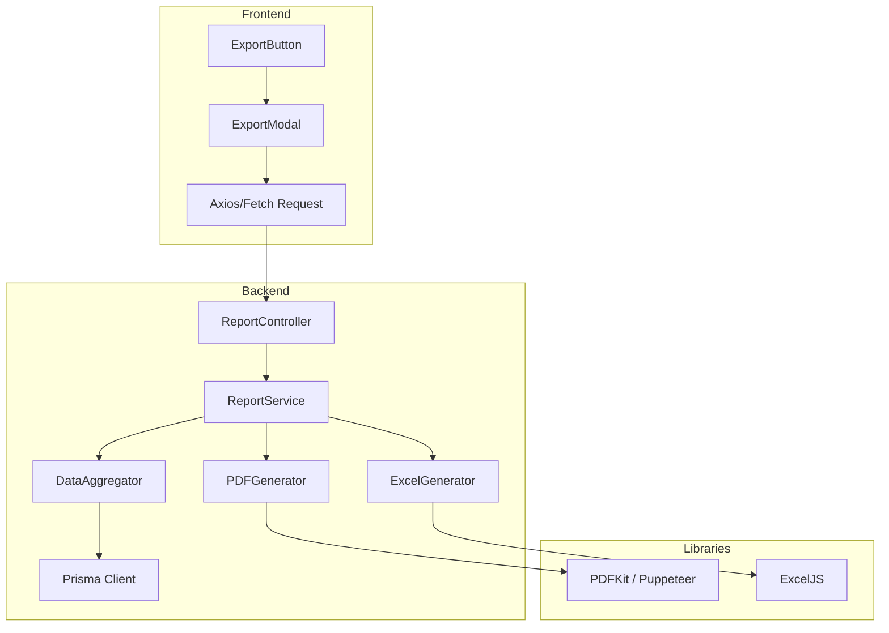

# 📊 Kế hoạch Triển khai: Hệ thống Xuất Báo cáo Nợ Thông minh (Smart Debt Reporting)

Tài liệu này mô tả chi tiết quy trình xây dựng tính năng xuất báo cáo chuyên sâu cho dự án **FinSight**, giúp người dùng có cái nhìn tổng quan và bằng chứng vật lý về tình hình tài chính cá nhân.

---

## 🎯 Mục tiêu Tính năng
1.  **Chuyên nghiệp**: Cung cấp báo cáo định dạng PDF/Excel với thiết kế cao cấp (premium).
2.  **Toàn diện**: Bao gồm danh sách nợ, chỉ số EAR, biểu đồ DTI, và dự báo rủi ro Domino.
3.  **Hành động được**: Đề xuất chiến lược trả nợ (Avalanche/Snowball) cụ thể theo tháng.
4.  **AI Insight**: Tích hợp nhận xét từ AI Agent vào báo cáo.

---

## 🏗️ Kiến trúc & Luồng Công việc (Workflow)

### 1. Sơ đồ Quy trình (Sequence Diagram)

### 2. Thành phần dữ liệu trong Báo cáo
| Phần | Nội dung chi tiết | Logic nghiệp vụ |
| :--- | :--- | :--- |
| **Tổng quan** | Tên, Thu nhập, Tổng dư nợ, Chỉ số DTI hiện tại | `calcDebtToIncomeRatio` |
| **Chi tiết Nợ** | Danh sách khoản nợ, Lãi suất APR vs EAR, Ngày đáo hạn | `calcEAR` |
| **Phân tích Rủi ro** | Cảnh báo Domino, Số lượng khoản nợ đáo hạn cùng lúc | `detectDominoRisk` |
| **Lộ trình Trả nợ** | Lịch thanh toán dự kiến (Avalanche/Snowball) | `simulateRepayment` |
| **Gợi ý AI** | Nhận xét từ AI Advisor về sức khỏe tài chính | `runAgenticChat` (Summary mode) |

---

## 🛠️ Danh sách việc cần làm (To-do List)

### Phase 1: Backend Infrastructure (Backend Specialist)
- [ ] **Cài đặt thư viện**:
    - `exceljs`: Cho việc xử lý file Excel chuyên nghiệp.
    - `pdfkit` hoặc `puppeteer-core`: Cho việc render PDF chất lượng cao từ HTML.
- [ ] **Tạo Report Service**: Viết logic tổng hợp dữ liệu từ nhiều Model (Debt, User, InvestorProfile, Notification).
- [ ] **Cài đặt API Endpoint**: `GET /api/debts/export` với các query params xử lý option.

### Phase 2: Logic & Calculation (Backend Specialist)
- [ ] **Data Formatter**: Chuyển đổi dữ liệu từ Database sang định dạng thân thiện với báo cáo (format tiền tệ VNĐ, ngày tháng).
- [ ] **Chart Static Renderer**: Giải pháp vẽ biểu đồ vào PDF (Sử dụng `canvas` trên server hoặc headless browser).

### Phase 3: UI/UX Implementation (Frontend Specialist)
- [ ] **Export Button Group**: Thêm nút "Xuất báo cáo" vào `DebtOverviewPage` với hiệu ứng hover/active cao cấp.
- [ ] **Export Modal**:
    - Lựa chọn định dạng (PDF/Excel).
    - Lựa chọn khoảng thời gian.
    - Lựa chọn các mục muốn bao gồm (Ví dụ: "Không bao gồm nợ đã trả").
- [ ] **Download Handler**: Xử lý stream file từ Backend, hiển thị Progress Bar khi đang tạo báo cáo.

### Phase 4: Polish & Premium Touch (Designer/Frontend)
- [ ] **PDF Template Design**: Thiết kế layout PDF với font chữ chuyên nghiệp, màu sắc đồng bộ với brand FinSight (Tránh màu tím mặc định AI).
- [ ] **Excel Styling**: Định dạng bảng tính có màu sắc phân cấp, đóng khung, và tự động tính toán tổng.

---

## 📈 Sơ đồ thành phần (Component Map)

---

## 💡 Đề xuất "Xịn xò" cho FinSight
1.  **Watermark bảo mật**: Thêm Watermark mờ tên người dùng và ngày xuất để tăng tính xác thực.
2.  **QR Code**: Thêm 1 mã QR ở cuối trang PDF dẫn về app để người dùng có thể cập nhật trạng thái nợ ngay lập tức sau khi xem báo cáo.
3.  **Màu sắc Severity**: Trong báo cáo PDF, các khoản nợ có lãi suất EAR > 20% hoặc có rủi ro Domino sẽ được highlight màu đỏ (Danger) tự động để cảnh báo người dùng.

---
*Tài liệu được soạn thảo bởi Antigravity AI Advisor.*
